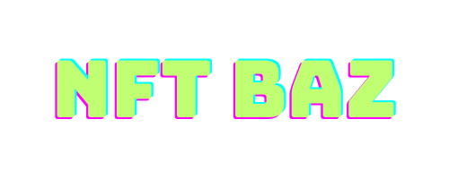

# What is it 🤔?

It is a simple nft store website named **NFT BAZ** like [OpenSea](https://opensea.io/) that made by:

* **Front** : [React](https://react.dev/), [React-Bootstrap](https://react-bootstrap.github.io/)

* **Back** : [Motoko Language](https://internetcomputer.org/docs/current/motoko/main/motoko)

# Features 🗃️

* You can Buy, Sell and Mint NFTs.

* **NFT BAZ** has a page named MyNFTs to check your sell your minted NFTs.

* Profiles protected by Principal and Auth system that are supported by [Internet Computer](https://internetcomputer.org/)

# Hints ⚠️:

* **1)** Project run on localhost, so I recommend checking internet computer doc to learn how to deploy it on the internet.

* **2)** It is a basic example of OpenSea website, and it is not completed yet.

* **3)** This Project comes from an exercise named 'OpenD' from BootCamp from Angela. ([The Complete 2023 Web Development Bootcamp](https://www.udemy.com/course/the-complete-web-development-bootcamp/)) and I just changed some designs and functions to work with the new Motoko version because openD was old and outdated.
